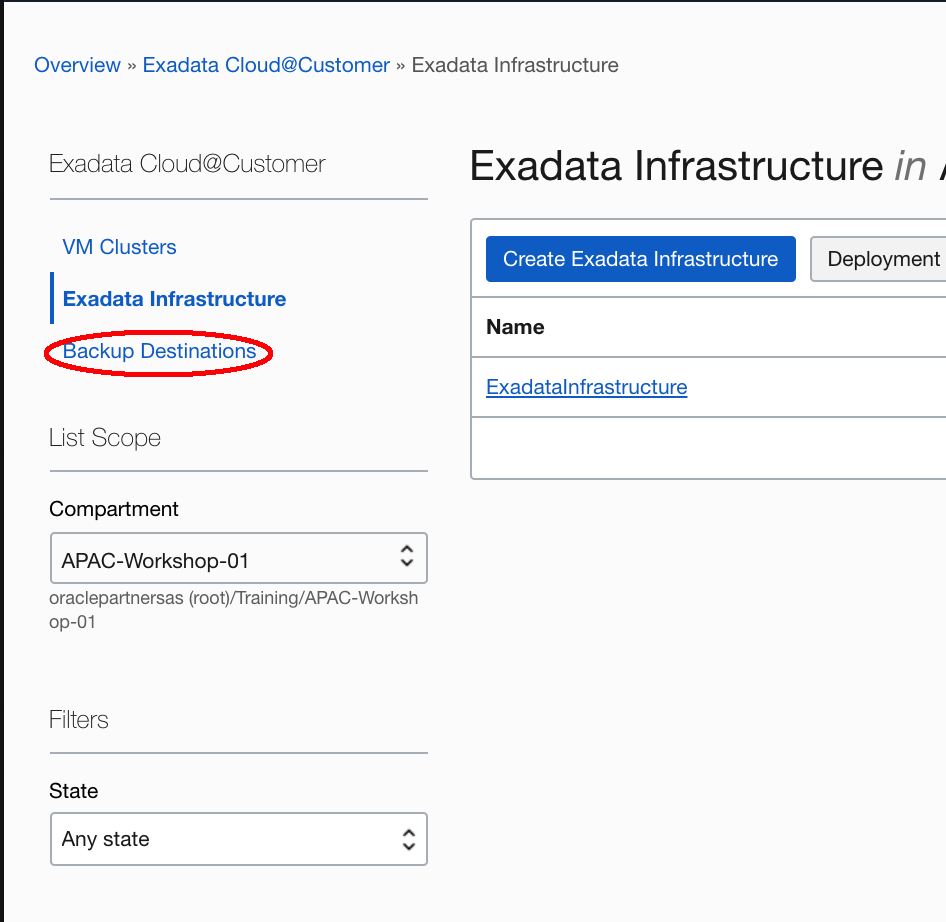
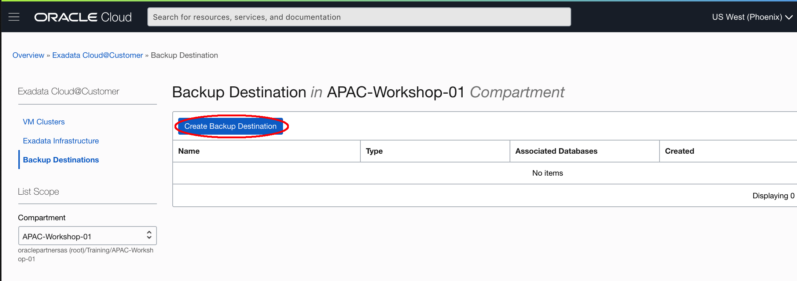
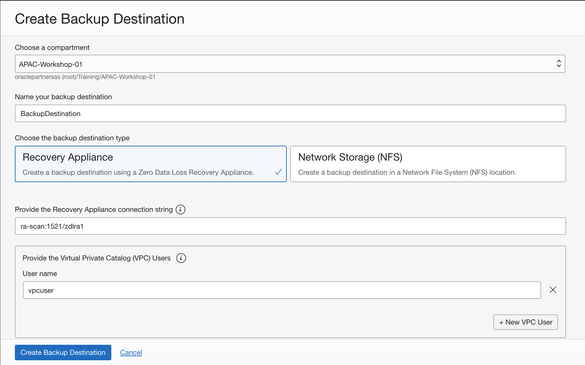
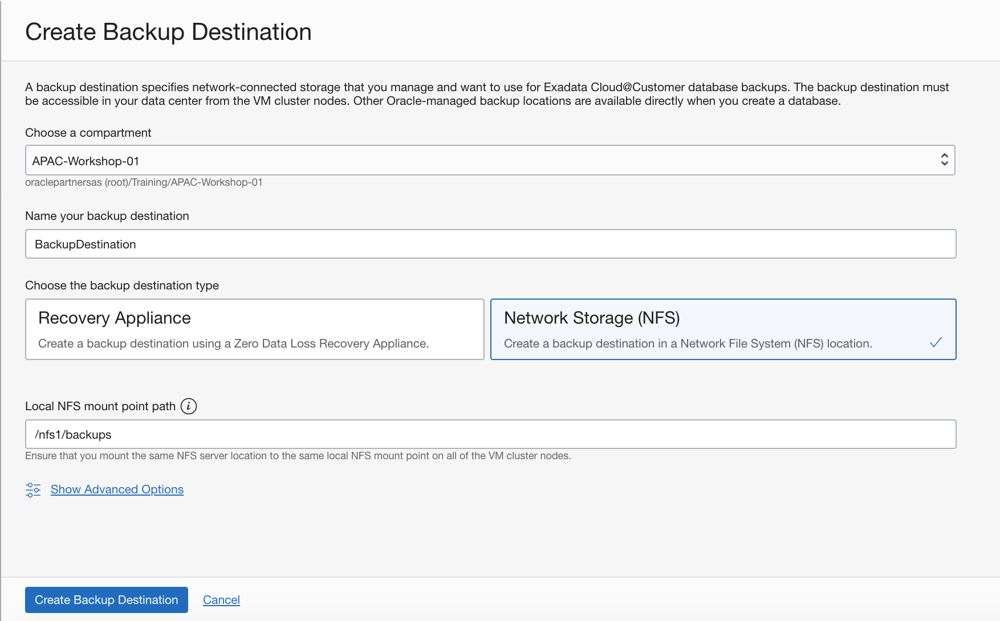
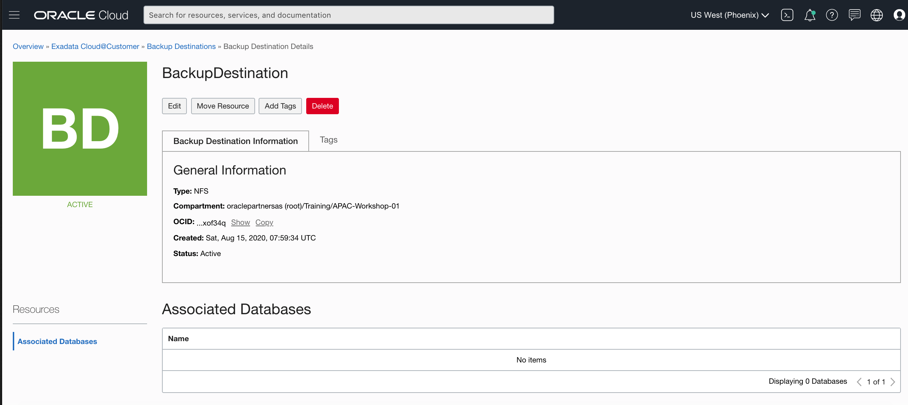

# Create Backup Destination

Exadata Cloud@Customer provides a backup facility, which you can configure individually on each database. 

If you want to store backups on a Recovery Appliance, or on a network file storage (NFS) location that you manage, then you must first create a backup destination. Each backup destination defines the properties that are required to connect to the Recovery Appliance or NFS location, and each backup destination must be accessible in your data center from the VM cluster nodes.

The Exadata Cloud@Customer backup facility can also store backups on Oracle Cloud Infrastructure object storage, or on local Exadata storage on your Exadata Cloud@Customer system. However, you do not need to create a backup destination for any of these other locations. Instead, applicable options for backup to cloud object storage or local Exadata storage are available directly when you create a database.

## Prerequisites

1. For a Zero Data Loss Recovery Appliance backup destination:

- The appliance must be configured with a virtual private catalog (VPC) user, which is used for taking the backups.
- The appliance must be configured with the unique database name of the database being backed up, and a mapping to the VPC user.
- The appliance must be accessible from the Exadata Cloud@Customer system using the Oracle Net Services connection string, which is provided by the Zero Data Loss Recovery Appliance administrator.

2. For an NFS backup destination:

- You must mount the NFS server location to a local mount point directory on each node in the VM cluster.
- The local directory path and the NFS server location must each be the same across all of the VM cluster nodes.
- You must ensure that the NFS mount is maintained continuously on all of the VM cluster nodes.
- The NFS-mounted file system must be readable and writable by the `oracle` operating system user on all of the VM cluster nodes.

## Create a Backup Destination

1. Open the navigation menu. Under **Database**, click **Exadata Cloud@Customer**. Choose the **Region** and **Compartment** that contains your Exadata infrastructure. Click **Backup Destinations**.

   

2. Click **Create Backup Destination**.

   

3. Provide the requested information in the **Create Backup Destination** page:

- Choose a compartment: From the list of available compartments, choose the compartment that you want to contain the backup destination.
- Name your backup destination: Specify a user-friendly name that you can use to identify the backup destination. 
- Choose either a Zero Data Loss Recovery Appliance or a network file system (NFS) backup destination.
   - If you select **Recovery Appliance**, then you must also specify the following for Zero Data Loss Recovery Appliance:
      - **Provide the Recovery Appliance connection string:** Specify the Oracle Net Services connection string that connects to the appliance. This information is typically provided by the Zero Data Loss Recovery Appliance administrator.
      - **Provide the Virtual Private Catalog (VPC) Users:** Provide a VPC user name for connecting to the Zero Data Loss Recovery Appliance. This information is typically provided by the Zero Data Loss Recovery Appliance administrator.

      

   - If you select **Network Storage (NFS)**, then you must also specify the following:
      - **Provide the local NFS mount point path:** Specify the local directory path on each VM cluster node where the NFS server location is mounted. The local directory path and the NFS server location must each be the same across all of the VM cluster nodes. 

      

4.Click **Create Backup Destination**. The Backup Destination Details page displays the newly created backup destination.

