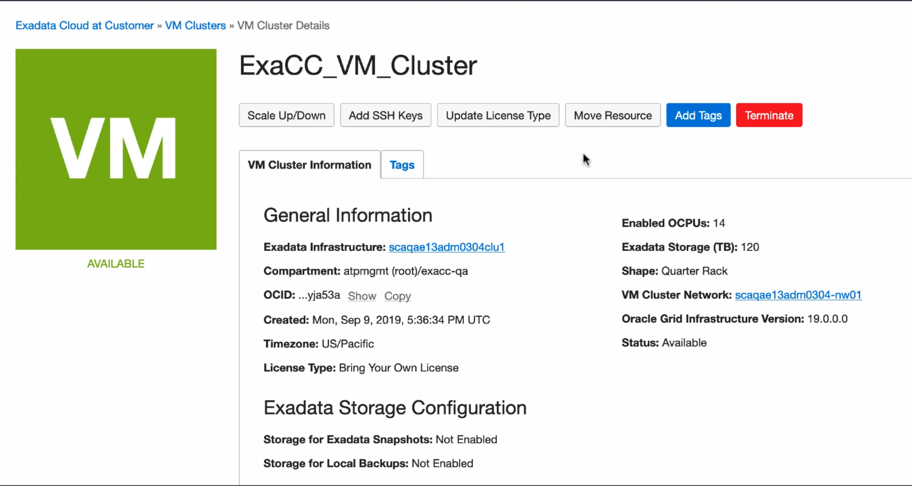
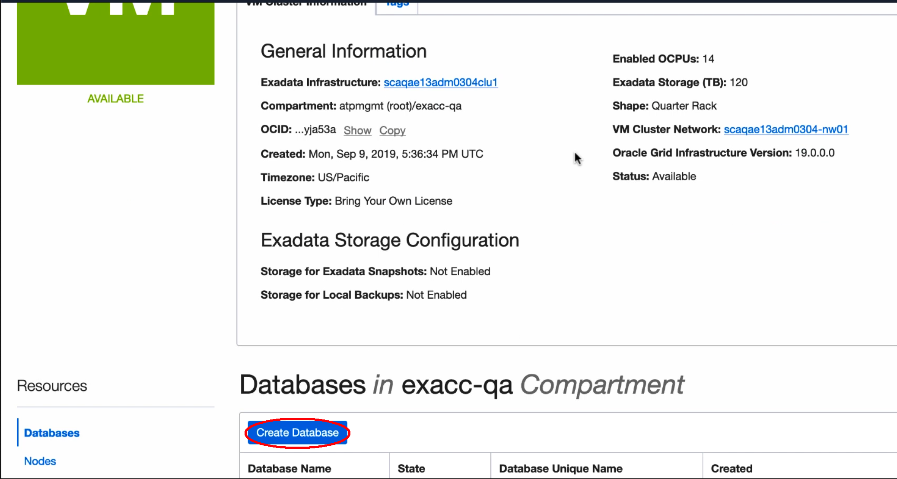
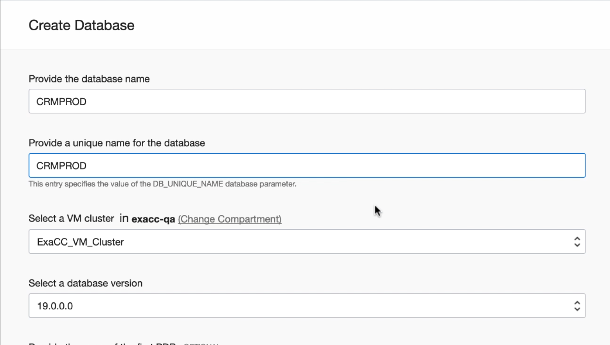
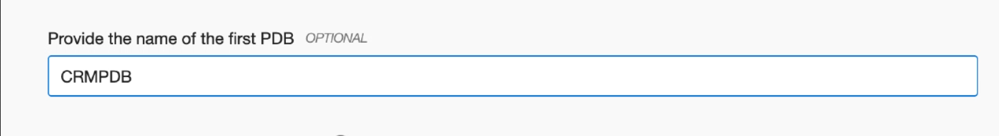
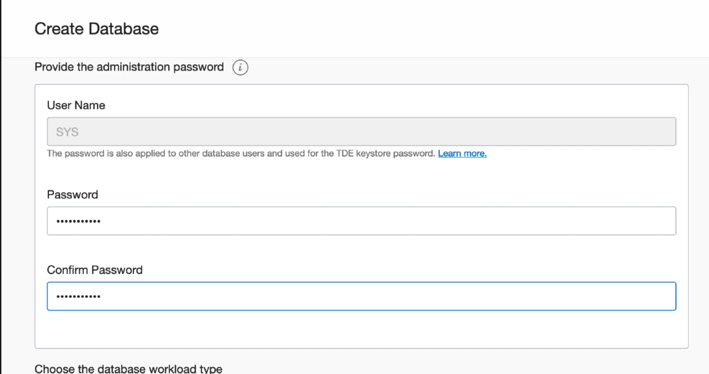
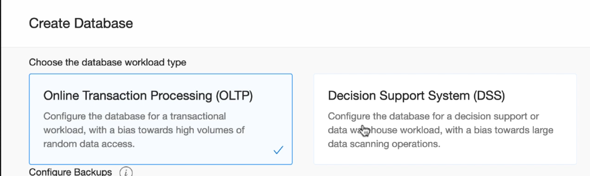
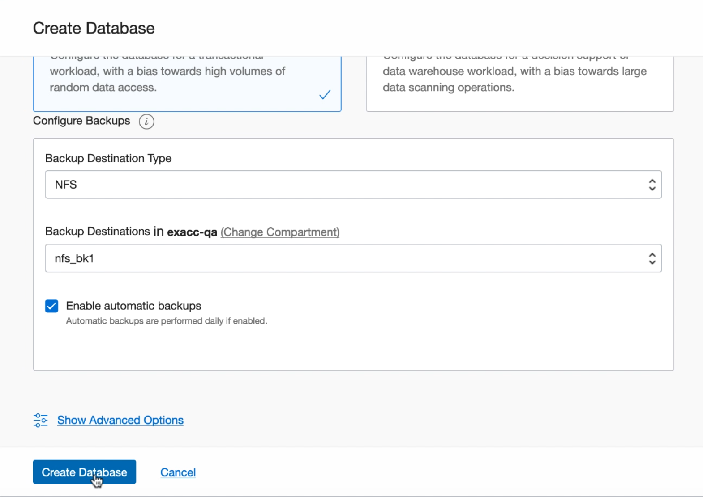
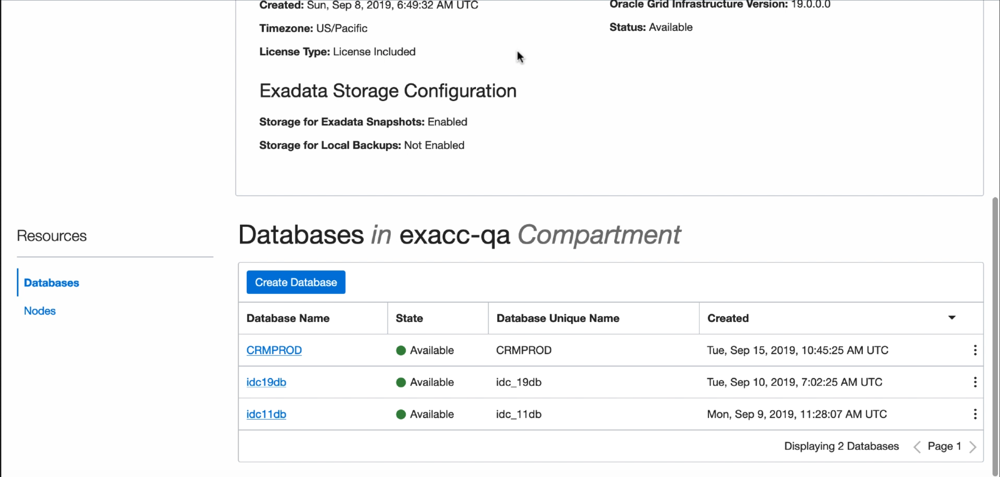

# Create Oracle Database on Exadata Cloud@Customer

You can create one or more databases on each Oracle Exadata Cloud@Customer system. Other than the storage and processing limits of your Oracle Exadata system, there is no maximum for the number of databases that you can create. By default, databases on Exadata Cloud@Customer use Oracle Database Enterprise Edition - Extreme Performance. This edition provides all the features of Oracle Database Enterprise Edition, plus all of the database enterprise management packs, and all of the Enterprise Edition options, such as Oracle Database In-Memory, and Oracle Real Application Clusters (Oracle RAC). If you use your own Oracle Database licenses, then your ability to use various features is limited by your license holdings.

## Prerequisites

Before you can create and use an Oracle Database on Exadata Cloud@Customer, you must:
- Provision Exadata Cloud@Customer infrastructure
- Configure a VM cluster
- Create any required backup destinations

## Create a Database

1. Open the navigation menu Under **Database**, and click **Exadata Cloud@Customer**.

   **VM Clusters** is selected by default. Choose your **Region** and **Compartment**. Click the name of a VM cluster where you want to create the database.

   

   

2. In the VM Cluster Details page, under **Resources**, **Databases** is selected by default. Click **Create Database**

   

3. Provide the requested information in the Create Database page:

- **Provide the database name**: Specify a user-friendly name that you can use to identify the database. 

- **Provide a unique name for the database**: Optionally specify a unique name for the database. This attribute defines the value of the `DB_UNIQUE_NAME` database parameter. The value is case insensitive, it can be up to 30 characters in length, and include alphanumeric characters, underscore (`_`), number sign (`#`), and dollar sign (`$`). If you plan to configure the database for backup to a Recovery Appliance backup destination, then the unique database name must match the name that is configured in the Recovery Appliance.

- **Select a database version**: From the list, choose the Oracle Database software release that you want to deploy.

  

  

- **Database Home**: Select an existing Database Home or create one as applicable. Note that this field is not available when you create a Database from the Database Home details page.

     - **Select an existing Database Home**: If one or more Database Homes already exist for the database version you have selected, then this option is selected by default. And, you will be presented with a list of Database Homes. Select a Database Home from the list.

     - **Create a new Database Home**: If no Database Homes exist for the database version you have selected, then this option is selected by default.

- **Provide the name of the first PDB**: (Optional) Specify the name for the first PDB. A PDB is created with the database.

  To avoid potential service name collisions when using Oracle Net Services to connect to the PDB, ensure that the PDB name is unique across the entire VM cluster. If you do not provide the name of the first PDB, then a system-generated name is used.

  

  

- **Provide the administration password**: Provide and confirm the Oracle Database administration password. This password is used for administration accounts and functions in the database, including:

     - The password for the Oracle Database `SYS` and `SYSTEM` users.
     - The Transparent Data Encryption (TDE) keystore password.

   

  

- **Choose the database workload type**: Select the workload type that best suits your application from one of the following options:

     - **Online Transactional Processing (OLTP)**: Select this option to configure the database for a transactional workload, with a bias toward high volumes of random data access.

     - **Decision Support System (DSS)**: Select this option to configure the database for a decision support or data warehouse workload, with a bias toward large data scanning operations.

   

  

- **Backup Destination Type:** Select a backup destination for the database. From the list, choose an option:

     - **None**: Select to not define a backup configuration for the database.
     - **Local**: Select to store backups locally in the Oracle Exadata Storage Servers on your Oracle Exadata Cloud@Customer system. This option is available only if you enabled backups on local Oracle Exadata storage in the VM cluster that you want to host the database.   
     - **Object Storage**: Select to store backups in an Oracle-managed object storage container on Oracle Cloud Infrastructure.
     - **NFS**: Select to store backups in one of your previously defined backup destinations that uses Network File System (NFS) storage.
     - **Recovery Appliance**: Select to store backups in one of your previously defined backup destinations that uses Oracle Zero Data Loss Recovery Appliance.

- **Enable automatic backups:** Select this option to enable daily backups using the policy for automatic backups.

  

  

4. Click **Create Database**. When the Database creation is complete, the status changes from `Provisioning` to `Available`.

   

   

