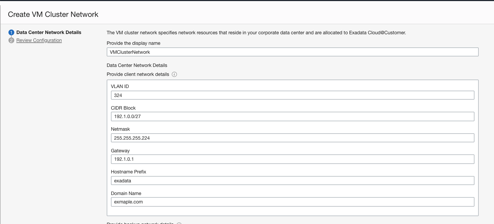
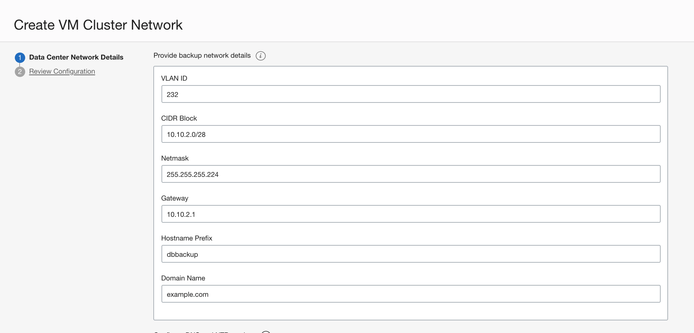
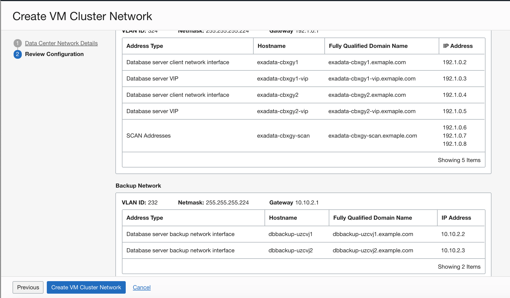
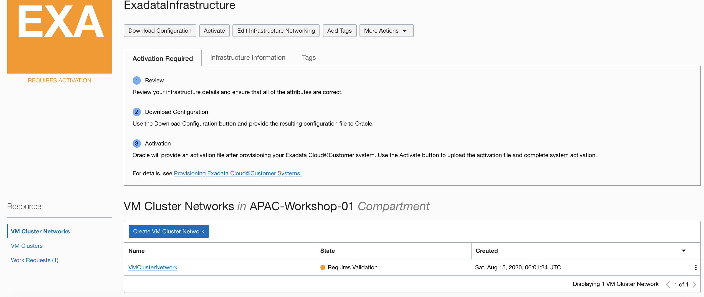
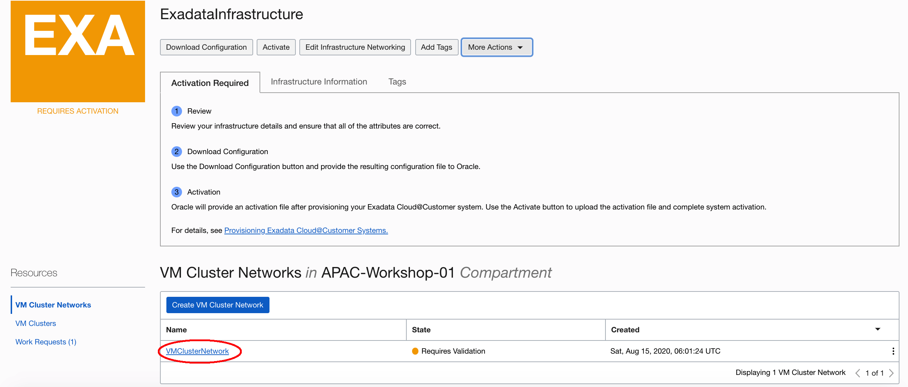
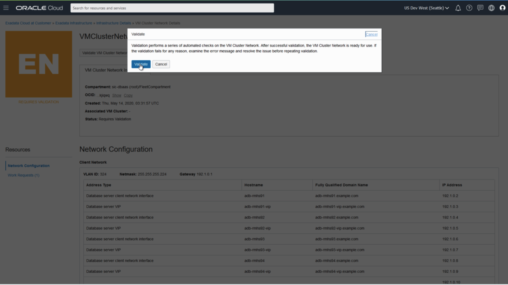

# Create VM Cluster Network

Before you can create any databases on your Exadata Cloud@Customer infrastructure, you must create a VM cluster network, and you must associate it with a VM cluster. Each Exadata Cloud@Customer infrastructure deployment can support one VM cluster network and associated VM cluster.

## Prerequisites

- Provision the Exadata infrastructure and actived

## Step 1. Create a VM Cluster Network

The VM cluster network specifies network resources, such as IP addresses and host names, that reside in your corporate data center and are allocated to Exadata Cloud@Customer. The VM cluster network includes definitions for the Exadata client network and the Exadata backup network. The client network and backup network contain the network interfaces that you use to connect to the VM cluster compute nodes, and ultimately the databases that reside on those compute nodes.

1. Log into your OCI Console, open the navigation menu. Under **Oracle Database**, click **Exadata Cloud@Customer**.

2. Click **Exadata Infrastructure**. Choose correct Region and Compartment. Then click the name of the Exadata infrastructure for which you create before.

   

3. In the Infrastructure Details page, Click **Create VM Cluster Network**.

   

4. Provide the requested information in the Data Center Network Details page:

- Provide the display name.

- In the Data Center Network Details, Provide client network details:

    - **VLAN ID:** Provide a virtual LAN identifier (VLAN ID) for the client network between `1` and `4094`, inclusive. To specify no VLAN tagging, enter "`1`". (This is equivalent to a "`NULL`" VLAN ID tag value.)
    - **CIDR Block:** Using CIDR notation, provide the IP address range for the client network.
    - **Netmask:** Specify the IP netmask for the client network.
    - **Gateway:** Specify the IP address of the client network gateway.
    - **Hostname Prefix:** Specify the prefix that is used to generate the hostnames in the client network.
    - **Domain Name:** Specify the domain name for the client network.
  

 

- Provide backup network details. The backup network is the secondary channel for connectivity to Exadata Cloud@Customer resources. It is typically used to segregate application connections on the client network from other network traffic.

    - **VLAN ID:** Provide a virtual LAN identifier (VLAN ID) for the backup network between `1` and `4094`, inclusive. To specify no VLAN tagging, enter "`1`". (This is equivalent to a "`NULL`" VLAN ID tag value.)
    - **CIDR Block:** Using CIDR notation, provide the IP address range for the backup network.
    - **Netmask:** Specify the IP netmask for the backup network.
    - **Gateway:** Specify the IP address of the backup network gateway.
    - **Hostname Prefix:** Specify the prefix that is used to generate the hostnames in the backup network.
    - **Domain Name:** Specify the domain name for the backup network.

  

- Provide DNS and NTP server details. The VM cluster network requires access to Domain Names System (DNS) and Network Time Protocol (NTP) services.

    - **DNS Servers:** Provide the IP address of a DNS server that is accessible using the client network. You may specify up to three DNS servers.
    - **NTP Servers:** Provide the IP address of an NTP server that is accessible using the client network. You may specify up to three NTP servers.

5. Click **Next** to review the configuration. If everything looks five. Click **Create VM Cluster Network**.

   

6. The VM Cluster Network Details page is now displayed. Initially after creation, the state of the VM cluster network is **Requires Validation**.

   

   

## Step 2. Download the VM Cluster Network Configuration File

You can download a configuration file, supply to your network administrator. The file contains the information needed to configure your corporate DNS and other network devices to work along with Exadata Cloud@Customer.

1. Click the VM Cluster Network name you created before. Navigate to the VM Cluster Network Detail page.

   

2. Click **Download Network Configuration**.

   

3. Your browser downloads a file containing the VM cluster network configuration details. The file name like:  `ocid1.vmclusternetwork.oc1.phx.abyhqljsjh...hkb3edsppfja.json`

   

## Step 3. Validate a VM Cluster Network

You can only validate a VM cluster network if its current state is **Requires Validation**, and if the underlying Exadata infrastructure is activated.

1. In the VM Cluster Network Details page. Click **Validate VM Cluster Network**.

   

2. In the resulting dialog, click **Validate** to confirm the action.

   

3. After successful validation, the state of the VM cluster network changes to **Validated** and the VM cluster network is ready to use. If validation fails for any reason, examine the error message and resolve the issue before repeating validation.

   

