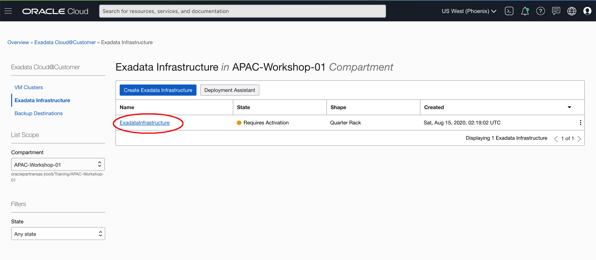
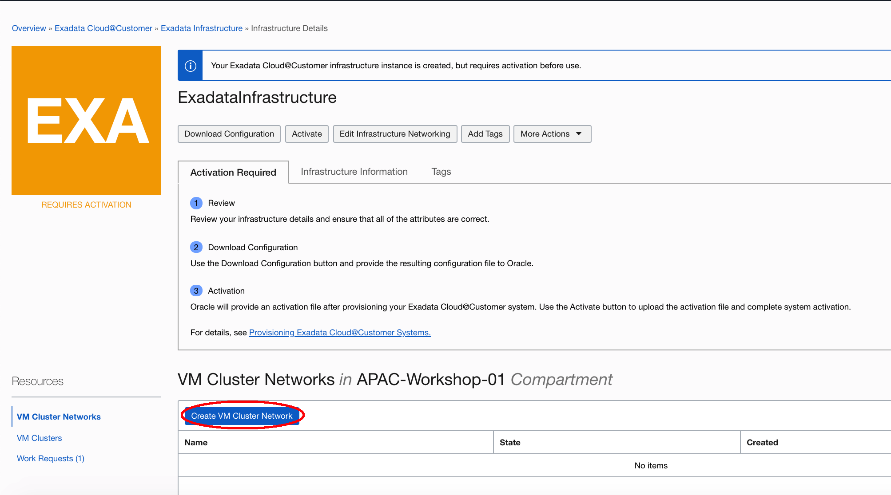
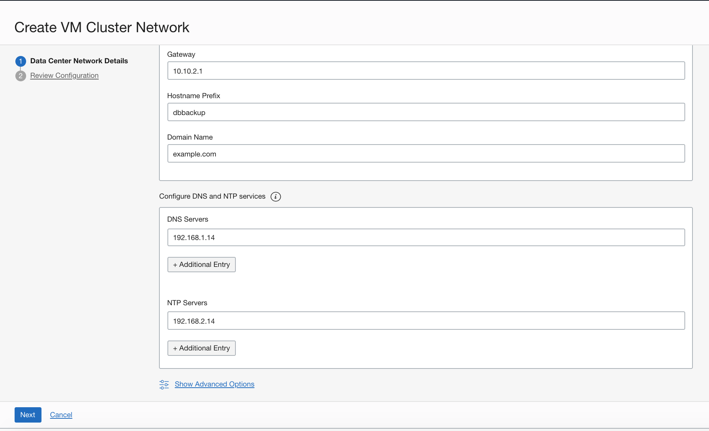
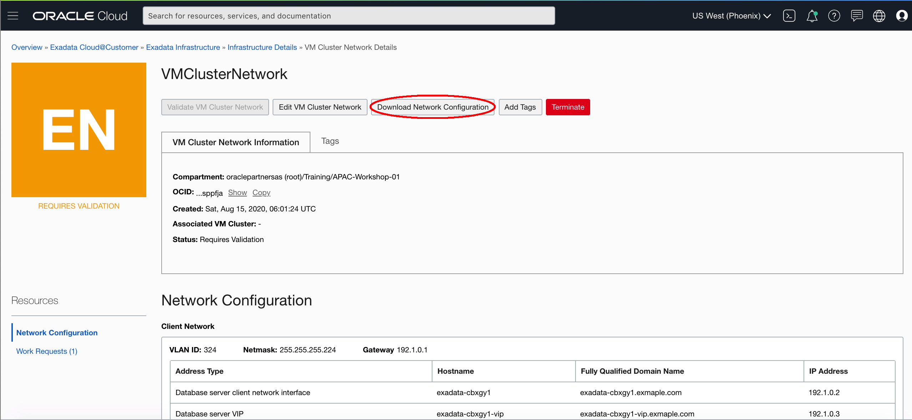
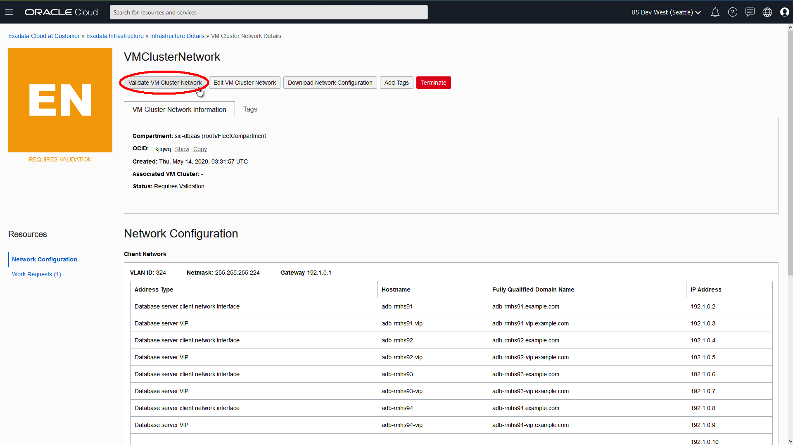
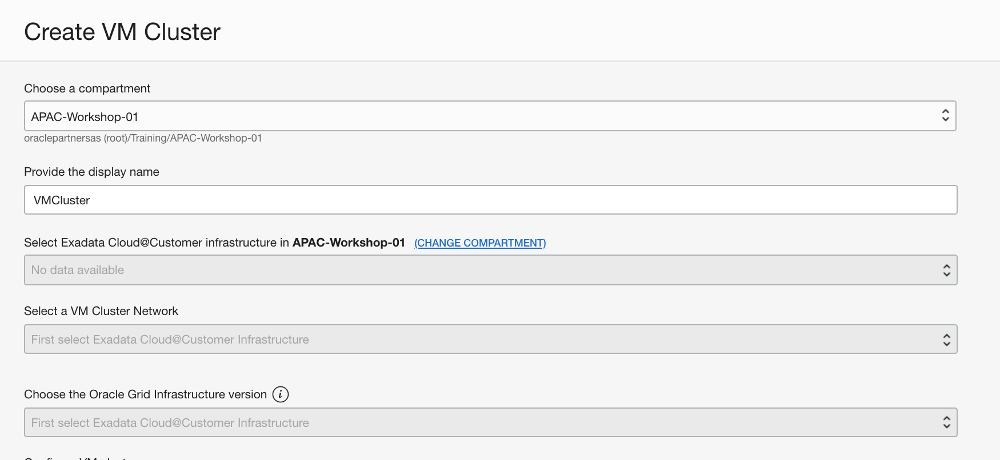

# Create a VM Cluster

The VM cluster provides a link between your Exadata Cloud@Customer infrastructure and Oracle Database.

Before you can create any databases on your Exadata Cloud@Customer infrastructure, you must create a VM cluster network, and you must associate it with a VM cluster. Each Exadata Cloud@Customer infrastructure deployment can support one VM cluster network and associated VM cluster.

## Prerequisites

- Complete the Provision the Exadata Cloud@Customer System Lab
- Prepare a SSH Key pair

## Step 1. Create a VM Cluster Network

The VM cluster network specifies network resources, such as IP addresses and host names, that reside in your corporate data center and are allocated to Exadata Cloud@Customer. The VM cluster network includes definitions for the Exadata client network and the Exadata backup network. The client network and backup network contain the network interfaces that you use to connect to the VM cluster compute nodes, and ultimately the databases that reside on those compute nodes.

1. Log into your OCI Console, open the navigation menu. Under **Oracle Database**, click **Exadata Cloud@Customer**.

2. Click **Exadata Infrastructure**. Choose correct Region and Compartment. Then click the name of the Exadata infrastructure for which you create before.

   

3. In the Infrastructure Details page, Click **Create VM Cluster Network**.

   

4. Provide the requested information in the Data Center Network Details page:

- Provide the display name.

- In the Data Center Network Details, Provide client network details:

  - **VLAN ID:** Provide a virtual LAN identifier (VLAN ID) for the client network between `1` and `4094`, inclusive. To specify no VLAN tagging, enter "`1`". (This is equivalent to a "`NULL`" VLAN ID tag value.)

  - **CIDR Block:** Using CIDR notation, provide the IP address range for the client network.

  - **Netmask:** Specify the IP netmask for the client network.

  - **Gateway:** Specify the IP address of the client network gateway.

  - **Hostname Prefix:** Specify the prefix that is used to generate the hostnames in the client network.

  - **Domain Name:** Specify the domain name for the client network.

- Provide backup network details. The backup network is the secondary channel for connectivity to Exadata Cloud@Customer resources. It is typically used to segregate application connections on the client network from other network traffic.

  - **VLAN ID:** Provide a virtual LAN identifier (VLAN ID) for the backup network between `1` and `4094`, inclusive. To specify no VLAN tagging, enter "`1`". (This is equivalent to a "`NULL`" VLAN ID tag value.)
  - **CIDR Block:** Using CIDR notation, provide the IP address range for the backup network.
  - **Netmask:** Specify the IP netmask for the backup network.
  - **Gateway:** Specify the IP address of the backup network gateway.
  - **Hostname Prefix:** Specify the prefix that is used to generate the hostnames in the backup network.
  - **Domain Name:** Specify the domain name for the backup network.

  

- Provide DNS and NTP server details. The VM cluster network requires access to Domain Names System (DNS) and Network Time Protocol (NTP) services.

  - **DNS Servers:** Provide the IP address of a DNS server that is accessible using the client network. You may specify up to three DNS servers.
  - **NTP Servers:** Provide the IP address of an NTP server that is accessible using the client network. You may specify up to three NTP servers.

5. Click **Next** to review the configuration. If everything looks five. Click **Create VM Cluster Network**.

   

6. The VM Cluster Network Details page is now displayed. Initially after creation, the state of the VM cluster network is **Requires Validation**.

   

   

## Step 2. Download the VM Cluster Network Configuration File

You can download a configuration file, supply to your network administrator. The file contains the information needed to configure your corporate DNS and other network devices to work along with Exadata Cloud@Customer.

1. Click the VM Cluster Network name you created before. Navigate to the VM Cluster Network Detail page.

   

2. Click **Download Network Configuration**.

   

3. Your browser downloads a file containing the VM cluster network configuration details. The file name like:  `ocid1.vmclusternetwork.oc1.phx.abyhqljsjh4grhslser7b2pwiovdmanlx6swekozscoue65dhkb3edsppfja.json`

   

## Step 3. Validate a VM Cluster Network

You can only validate a VM cluster network if its current state is **Requires Validation**, and if the underlying Exadata infrastructure is activated.

1. In the VM Cluster Network Details page. Click **Validate VM Cluster Network**.

   

2. In the resulting dialog, click **Validate** to confirm the action.

   

3. After successful validation, the state of the VM cluster network changes to **Validated** and the VM cluster network is ready to use.

   

## Step 4. Create a VM Cluster

To create a VM cluster, ensure that you that have:

- Active Exadata infrastructure available to host the VM cluster.
- A validated VM cluster network available for the VM cluster to use.

1. Open the navigation menu. Under **Oracle Database**, click **Exadata Cloud@Customer**. Choose the **Region** and **Compartment** that contains your Exadata infrastructure. Click **VM Clusters**.

   

2. Click **Create VM Cluster**.

   

3. Provide the requested information in the Create VM Cluster page：

- **Choose a compartment:** From the list of available compartments, choose the compartment that you want to contain the VM cluster.

- **Provide the display name:** The display name is a user-friendly name that you can use to identify the VM cluster. 

- **Select Exadata Cloud@Customer Infrastructure:** From the list, choose the Exadata infrastructure to host the VM cluster. You are not able to create a VM cluster without available and active Exadata infrastructure.

- **Select a VM Cluster Network:** From the list, choose a VM cluster network definition to use for the VM cluster. You must have an available and validated VM cluster network before you can create a VM cluster.

- **Choose the Oracle Grid Infrastructure version: **From the list, choose the of Oracle Grid Infrastructure release that you want to install on the VM cluster.

  

- **Specify the OCPU count per VM:** Specify the OCPU count for each individual VM. The count must be a value greater than 2 and up to the number of remaining unallocated CPU cores.

- **Requested OCPU count for the VM Cluster:** Displays the total number of CPU cores that are allocated to the VM cluster based on the value you specified in the **Specify the OCPU count per VM** field.

- **Specify the memory per VM (GB):** Specify the memory for each individual VM. The vaule must be a multiple of 1 GB and is limited by the available memory on the Exadata infrastructure.

- **Requested memory for the VM Cluster (GB):** Displays the total amount of memory that are allocated to the VM cluster based on the value you specified in the Specify the memory per VM (GB) field.

- **Specify the local file system size per VM (GB):** Specify the size for each individual VM. The value must be a multiple of 1 GB and is limited by the available size of the file system on the X8-2 and X7-2 infrastructures.

  

- **Configure the Exadata Storage:** The following settings define how the Exadata storage is configured for use with the VM cluster. These settings cannot be changed after creating the VM cluster.

  - **Specify Usable Exadata Storage:** Specify the size for each individual VM. The minimum recommended size is 2 TB.
  - **Allocate Storage for Exadata Snapshots:** Check this option to create a sparse disk group, which is required to support Exadata snapshot functionality. Exadata snapshots enable space-efficient clones of Oracle databases that can be created and destroyed very quickly and easily.
  - **Allocate Storage for Local Backups:** Check this option to configure the Exadata storage to enable local database backups. If you select this option, more space is allocated to the RECO disk group to accommodate the backups. If you do not select this option, you cannot use local Exadata storage as a backup destination for any databases in the VM cluster.

  

- **Add SSH Key:** Specify the public key portion of an SSH key pair that you want to use to access the VM cluster compute nodes. You can upload a file containing the key, or paste the SSH key string.

  To provide multiple keys, upload multiple key files or paste each key into a separate field. For pasted keys, ensure that each key is on a single, continuous line. The length of the combined keys cannot exceed 10,000 characters.

- **Choose a license type:**

  - **Bring Your Own License (BYOL):** Select this option if your organization already owns Oracle Database software licenses that you want to use on the VM cluster.
  - **License Included:** Select this option to subscribe to Oracle Database software licenses as part of Exadata Cloud@Customer.

  

- Click **Show Advanced Options**. The default time zone for the Exadata Infrastructure is UTC, but you can specify a different time zone. 

  

- Click **Create VM Cluster**. The VM Cluster Details page is now displayed. While the creation process is running, the state of the VM cluster is **Pending**. When the VM cluster creation process completes, the state of the VM cluster changes to **Available**.

  

  

4. Now the VM Cluster is ready, you can move on to the next lab.

