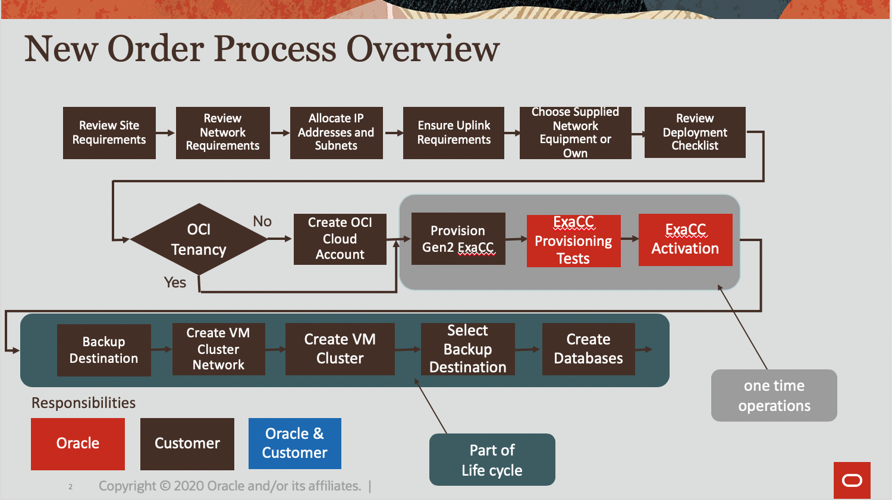

# Introduction

Oracle Exadata Cloud@Customer combines the performance of Oracle Exadata with the simplicity, flexibility, and affordability of a managed database service in your data centers. It’s the simplest way to move your existing Oracle Databases to the cloud because it provides full compatibility with your existing Exadata systems and Exadata Cloud Service. It also enables you to meet your needs for data sovereignty and low-latency connectivity to existing data center resources while achieving higher database consolidation and scaling than is possible with other on-premises database cloud services.

With Oracle Exadata Cloud@Customer, you can maintain absolute control over your data while leveraging the combined capabilities of Oracle Exadata and Oracle Cloud Infrastructure managed by Oracle.

This is the order process of the Gen2 Exadata Cloud@Customer:

In this workshop, You will learn how to provision an Exadata Cloud@Customer. It assumes you already have the OCI Cloud Account and meet the ExaCC preparation requirements. Please refer to [the link to check the ExaCC preparation](https://docs.cloud.oracle.com/en-us/iaas/exadata/doc/eccpreparing.html).

## Acknowledgements

- **Authors/Contributors** - Minqiao Wang, DB Product Management, Aug 2020
- **Last Updated By/Date** - 
- **Workshop Expiration Date** - 

