#Provisioning Exadata Cloud@Customer System

To provision an Oracle Exadata Cloud@Customer system, you must work with Oracle to set up and configure the system.

Provisioning an Oracle Exadata Cloud@Customer system is a collaborative process. The process is performed in the following sequence:

1. You create the Oracle Exadata Cloud@Customer infrastructure.
2. You generate a file containing the infrastructure configuration details, and provide it to Oracle.
3. The Oracle Exadata Cloud@Customer system is physically installed in your data center.
4. Oracle uses the infrastructure configuration file to perform initial system configuration. At the end of this task, Oracle supplies you with an activation file.
5. You activate the Exadata Cloud@Customer infrastructure by using the supplied activation file.

## Prerequisites

- You have an OCI account
- Your Oracle Cloud Infrastructure tenancy must be enabled to use Oracle Exadata Cloud@Customer. 
- Your corporate data center and network infrastructure meet the [requirements](https://docs.cloud.oracle.com/en-us/iaas/exadata/doc/eccpreparing.html).

## Step 1. Create the ExaCC Infrastructure

1. From your OCI console, Open the navigation menu. Under **Oracle Database**, click **Exadata Cloud@Customer**.

   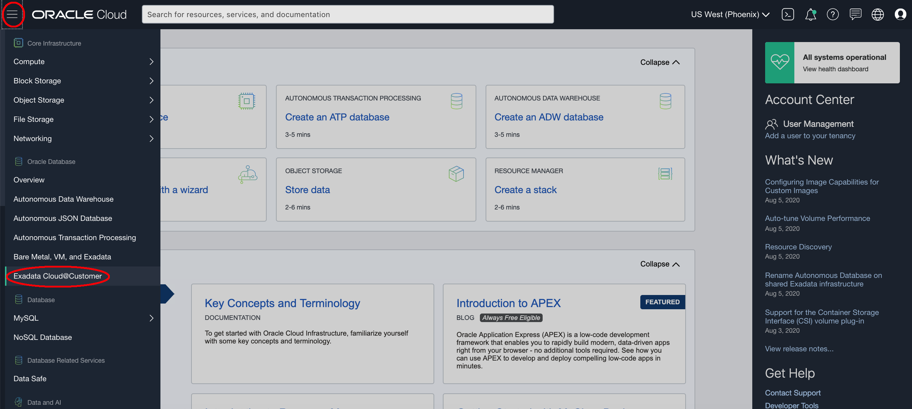

2. Select the region that you want to associate with the Oracle Exadata infrastructure. Select the compartment which you have privilege and want work in. Click **Exadata Infrastructure**.

   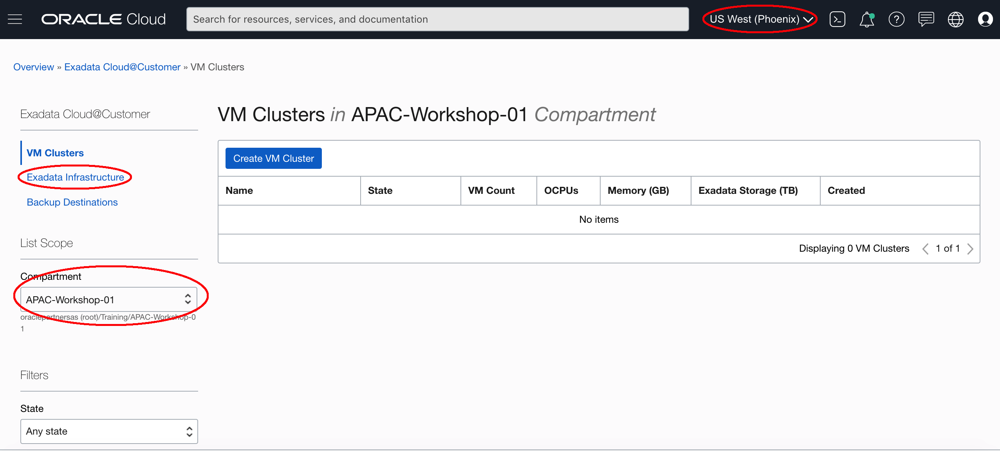

3. Click **Create Exadata Infrastructure**.

   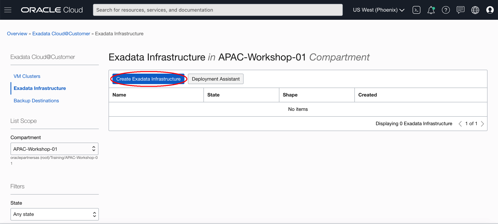

4. In the Create Exadata Infrastructure page, provide the requested information:

- **Oracle Cloud Infrastructure region:** The region that is associated with your Oracle Exadata infrastructure cannot be changed after the Oracle Exadata infrastructure is created. If you want switch regions now, use the **Region** menu at the top of the console.

- **Choose a compartment:** From the list of available compartments, choose the compartment that you want to contain the Oracle Exadata infrastructure.

- **Provide the display name:** The display name is a user-friendly name that you can use to identify the Exadata infrastructure.

- **Select the Exadata system model:** From the list, choose the model of the Oracle Exadata hardware that is being used.

- **Select an Exadata system shape:** Together with the Oracle Exadata system model, the Oracle Exadata system shape defines the amount of CPU, memory, and storage resources that are available in the Oracle Exadata infrastructure.

  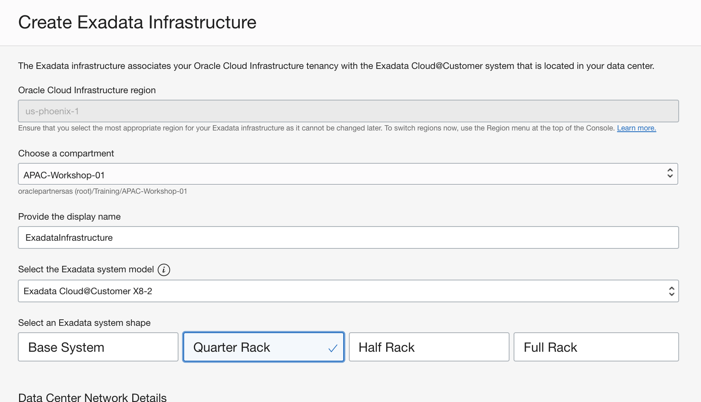

- **Configure the cloud control plane network**: Each Oracle Exadata Cloud@Customer system contains two control plane servers, which enable connectivity to Oracle Cloud Infrastructure. The control plane servers are connected to the control plane network, which is a subnet on your corporate network. 

  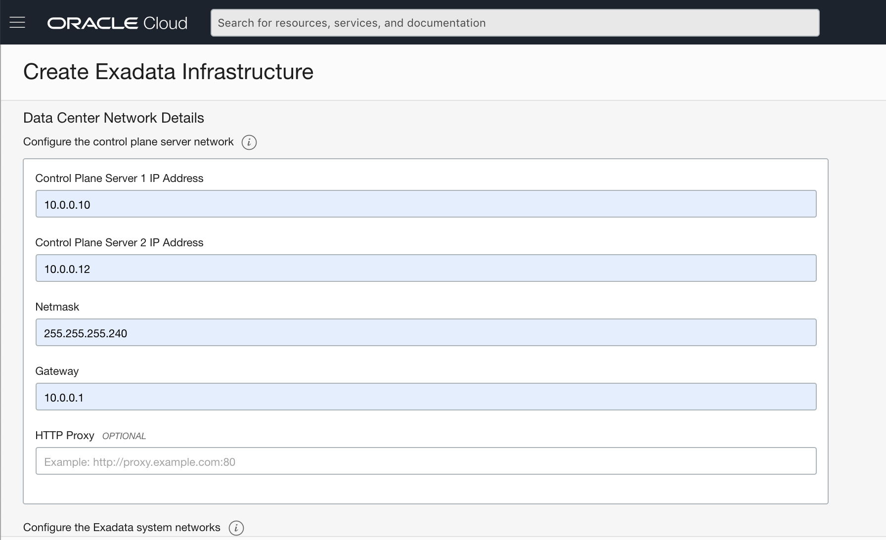

- **Configure the Oracle Exadata system networks**

  Each Oracle Exadata Cloud@Customer system contains two system networks, which are not connected to your corporate network. The following settings define IP address allocations for these networks:

    - **Administration Network CIDR Block:** Specifies the IP address range for the administration network using CIDR notation. The administration network provides connectivity that enables Oracle to administer the Exadata system components, such as the Exadata compute servers, storage servers, network switches, and power distribution units. You can accept the suggested default, or specify a custom value. The maximum CIDR block prefix length is `/23`, The minimum CIDR block prefix length is `/16`.

    - **InfiniBand Network CIDR Block:** Specifies the IP address range for the Exadata InfiniBand network using CIDR notation. The Exadata InfiniBand network provides the high-speed low-latency interconnect used by Exadata software for internal communications between various system components. You can accept the suggested default, or specify a custom value. The maximum CIDR block prefix length is `/22`,  The minimum CIDR block prefix length is `/19`.

    

  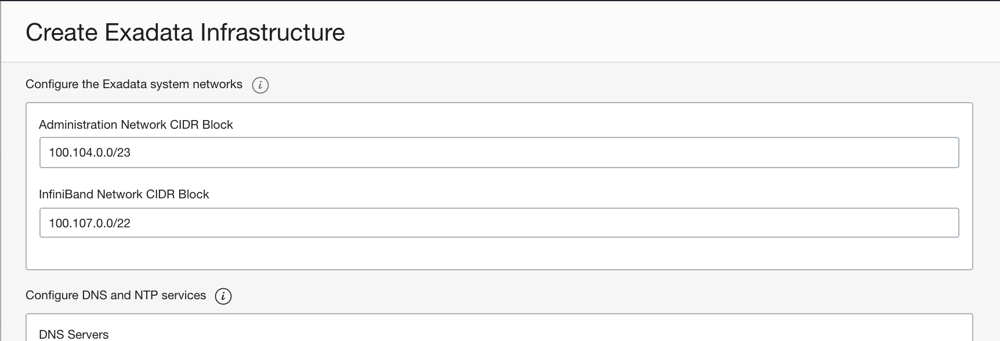

- **Configure DNS and NTP services**

  Each Exadata Cloud@Customer system requires access to Domain Names System (DNS) and Network Time Protocol (NTP) services. The following settings specify the servers that provide these services to the Exadata infrastructure:

    - **DNS Servers:** Provide the IP address of a DNS server that is accessible using the control plane network. You may specify up to three DNS servers.
  
    - **NTP Servers:** Provide the IP address of an NTP server that is accessible using the control plane network. You may specify up to three NTP servers.
  
    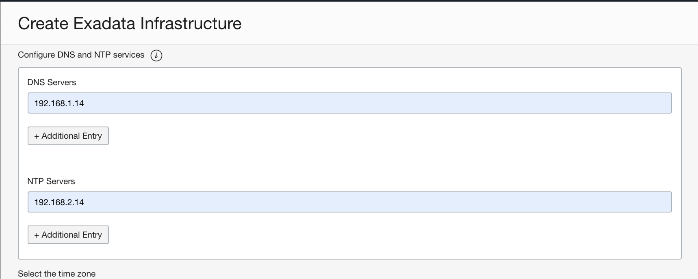

- **Time Zone:** The default time zone for the Exadata Infrastructure is UTC, but you can specify a different time zone. Select the **Select another time zone** option, select a **Region** or **country**, and then select the corresponging **Time zone**.

  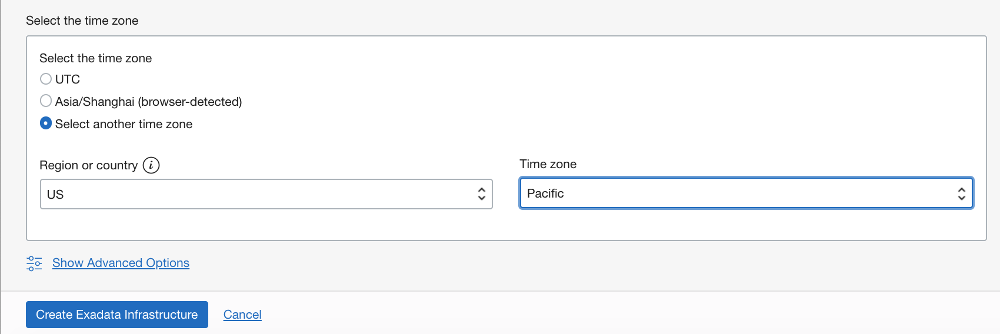

5.Click **Create Exadata Infrastructure**, then the Infrastructure Details page appears.

   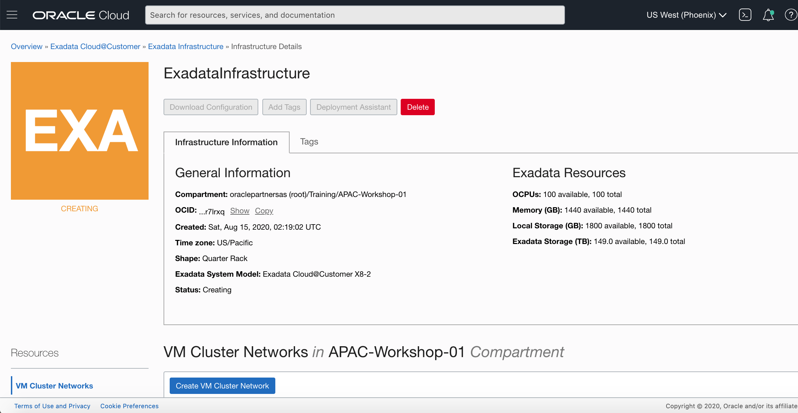

6.Initially after creation, the state of the Oracle Exadata infrastructure is **Requires Activation**.

   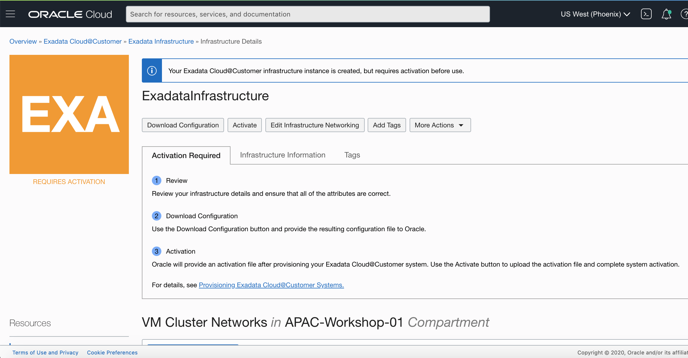

   

##Step 2. Download a File Containing Configuration Data

1. Now you are in the Exadata Infrastructure Details page. You can click **Edit Infrastructure Networking** to modify your configuration. After you are sure that all the attributes are correct. Click **Download Configuration**.

   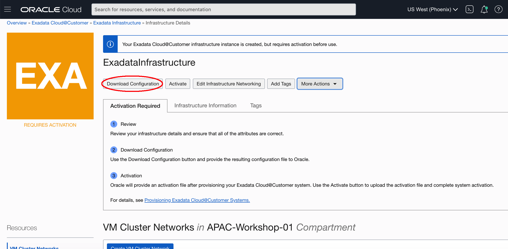

2. A zip file will be downloaded. The file name like: `ocid1.exadatainfrastructure.oc1.phx.abyhqljshftbqvs2...atn6q5hykkusr7lrxq.zip`

3. Provide the generated infrastructure configuration file to Oracle, ensure that it has not been altered in any way. Also, ensure that you do not edit the Oracle Exadata infrastructure after you download the configuration file and provide it to Oracle. Oracle will install and initialize the Exadata Cloud@Customer system based on your configuration.

   

## Step 3. Activate Exadata Cloud@Customer Infrastructure

1. After installation and initial configuration of your Oracle Exadata Cloud@Customer system, Oracle will supply you the activation file. Download the activation file.

2. From the OCI console, navigate to the Exadata Infrastructure you created before and goto the Infrastructure detail page. Click **Activate**.

   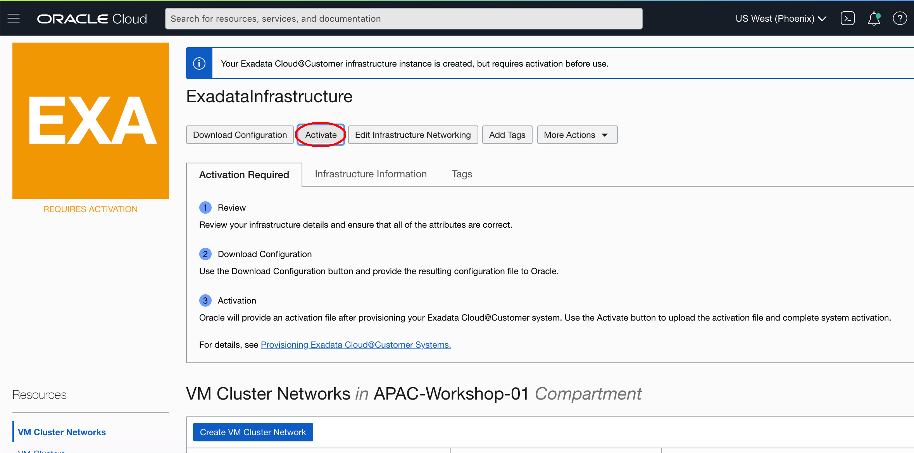

3. In the Activate dialog, select and upload the activation file, and then click **Activate Now**.

   

4. After activation, the state of the Oracle Exadata infrastructure changes to **Active**.

   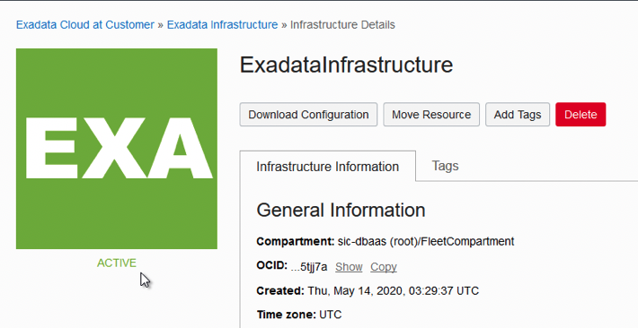

Now, you are successfully create the Exadata Cloud@Customer Infrastructure. You can go on to the next lab.